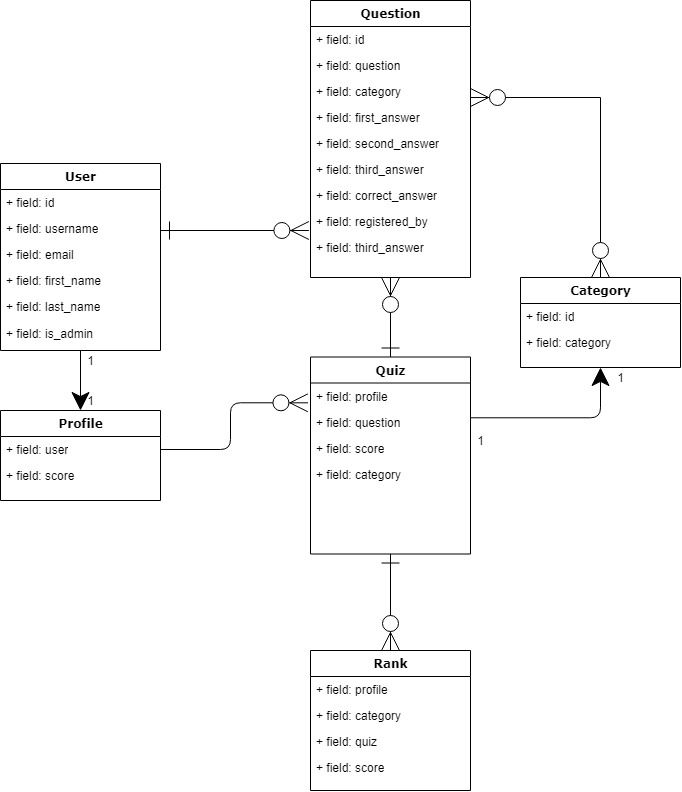

##  Desafio Backend Python

## Modelagem do banco

## Tasklist

- [ ] Implementar modelo de user personalizado

## Download & Instruções para instalação.

* 1 - Clone o projeto: git clone https://github.com/JonathaCnB/desafio-backend.git
* 2 - cd desafio-backend
* 3 - Criar virtual environment: python -m venv venv
* 4 - venv\scripts\activate
* 5 - pip install -r requirements.txt
* 6 - python manage.py runserver