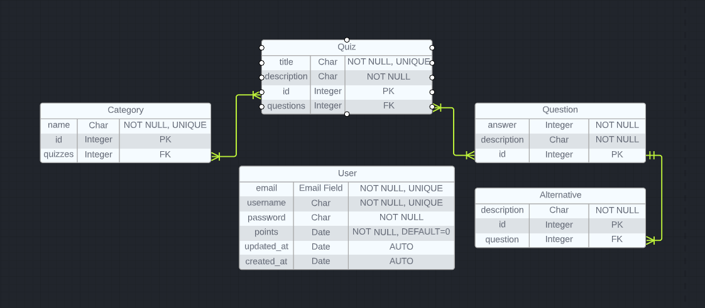

# Quiz API

This is a restful API for a quiz game. The user must complete quizzes consisted of various questions to earn points and achieve the first place in the rank!

---

## Installation

1. Clone this repository:

```bash
git clone $repo_link
```

2. Go to the repository folder:

```bash
cd $repo_name
```

3. Done!

---

## Usage

**<details><summary>With Docker</summary>**

1. Create a docker image

```bash
docker build -t quiz-docker -f Dockerfile .
```

2. Run the image

```bash
docker run -it -p 8888:8888 quiz-docker
```

3. Done!

</details>

**<details><summary>Without Docker</summary>**

1. Create and initiate a local environment:

```bash
python -m venv venv
source venv/bin/activate
```

2. Install the required dependencies (the next command uses [pip](https://pip.pypa.io/en/stable/). Use the one you like):

```bash
pip install -r requirements.txt
```

3. Make migrations and migrate

```bash
./manage.py makemigrations
./manage.py migrate
```

3. Run the server

```bash
gunicorn core.wsgi:application --bind 0.0.0.0:8888
```

4. Done!

</details>

---

## Routes

**<details><summary>Game</summary>**

Play

```bash
[GET, POST]
/api/play/$category_id/
```

Ranking

```bash
[GET]
/api/ranking/
```

</details>

**<details><summary>Users</summary>**

Login

```bash
[POST]
/api/login/
```

Register

```bash
[POST]
/api/register/
```

List All

```bash
[GET]
/api/users/
```

Retrieve

```bash
[GET]
/api/users/$user_id/
```

</details>

**<details><summary>Quiz</summary>**

List and Create

```bash
[GET, POST]
/api/quizzes/
```

Retrieve, Edit and Delete

```bash
[GET, POST, PATCH, DELETE]
/api/quizzes/$quiz_id/
```

</details>

**<details><summary>Categories</summary>**

List and Create

```bash
[GET, POST]
/api/categories/
```

Retrieve, Edit and Delete

```bash
[GET, POST, PATCH, DELETE]
/api/categories/$category_id/
```

</details>

**<details><summary>Questions</summary>**

List and Create

```bash
[GET, POST]
/api/questions/
```

Retrieve, Edit and Delete

```bash
[GET, POST, PATCH, DELETE]
/api/questions/$question_id/
```

</details>

---

## Notes

**Entity–Relationship Model:**



**default admin:**

```json
{
  "email": "admin@mail.com",
  "password": "P4ssw0rD"
}
```

If you are not using docker, you need to run the `create_admin.py` before using the default admin:

```bash
./manage.py create_admin
```

---

- The Postman collection is in the repository root folder, it is complete with all the available routes.
